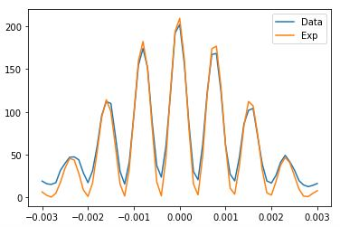

# NonLinearCurveFitting

## Basic Explanation for Non linear CurveFitting
Using scipy 1.70 version  
If Jupyter file make rendering issue,  
Go below url to see jupyter notebook  
https://nbviewer.jupyter.org/gist/peardragon/2962fc4b04f149a90986dc2b86f43568
